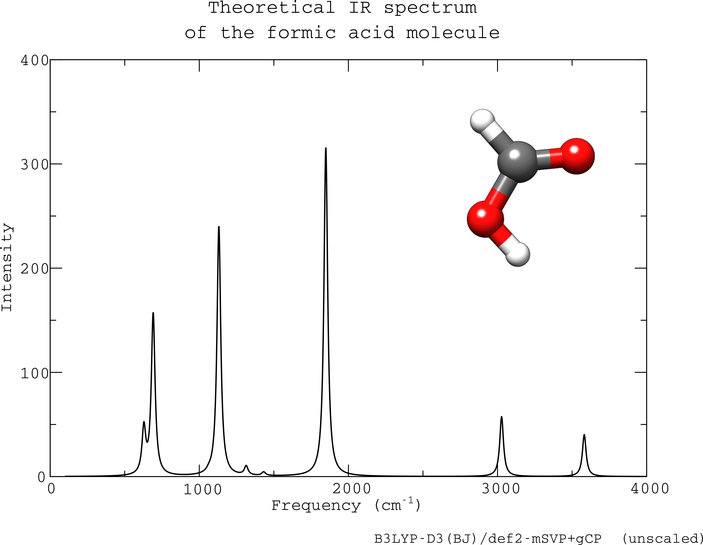

# spectramod
`spectramod` is a small, self-contained Fortran module that can be used to read in vibrational spectra in the JCAMP-DX (`.jdx`) format, as a plain list of datapoints, or in TURBOMOLE's `vibspectrum` format.

As a small example this repo contains a small program that can read in a spectrum in one of the above formats and write a list of datapoints that can be plotted using programs such as `gnuplot` or `xmgrace`.
Use 
```bash
gfortran spectramod.90 main.f90 -o specplot
```
to build the example tool.

A precompiled version of this program (`specplot`) and the theoretical spectrum of formic acid at the B3LYP-D3(BJ)/def2-mSVP + gCP level can be found in the `example` directory.

<div align="center">

</div>
